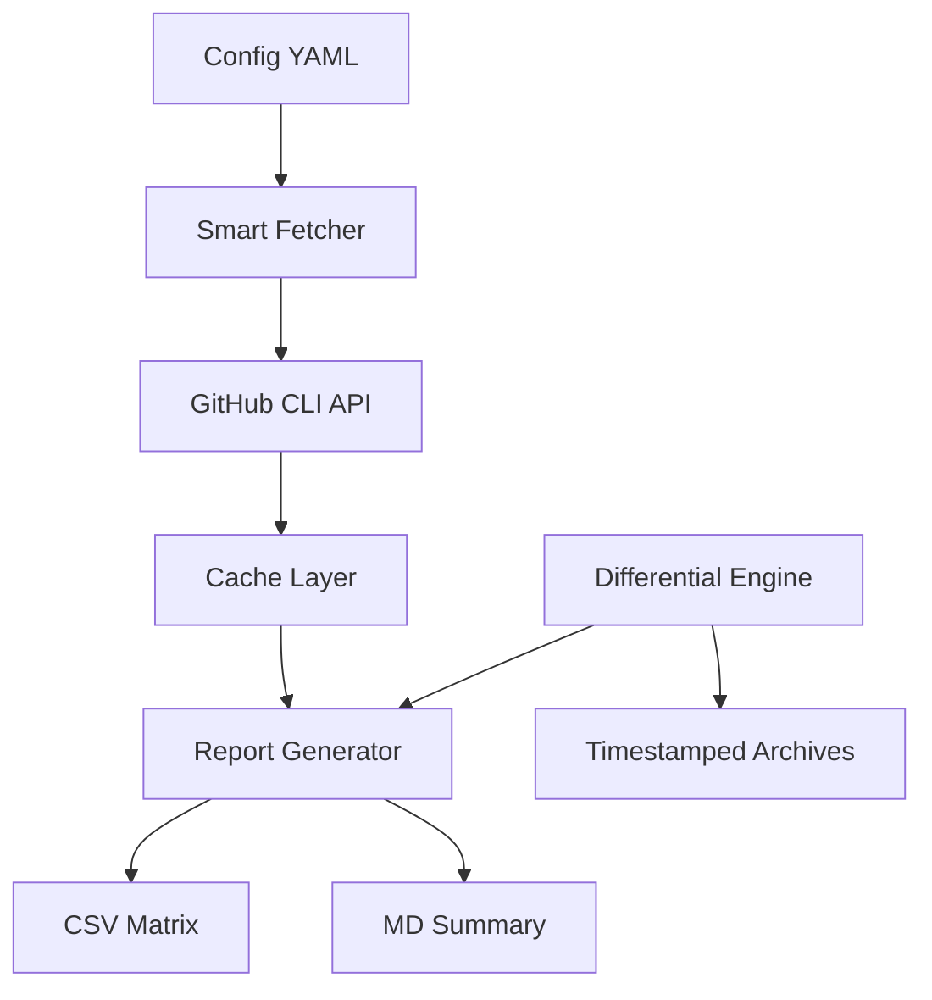

# GitHub Teams Fetcher

[](https://github.com/ishikawam/github-teams-fetcher/actions)
[](https://opensource.org/licenses/MIT)
[](https://www.python.org/downloads/)
[](https://github.com/psf/black)

A powerful, open-source tool for fetching and analyzing GitHub organization team and member data with smart caching, differential reporting, and comprehensive analysis capabilities.

## ✨ Features

- 🏢 **Multi-Organization Support**: Efficiently manage multiple GitHub organizations
- 👥 **Smart Data Fetching**: Intelligent caching with configurable TTL (24-hour default)
- 📊 **Comprehensive Reporting**: Generate detailed member×team matrices and summary reports
- 🔄 **Differential Updates**: Only create new report files when content actually changes
- 📈 **Advanced Analytics**: Team membership statistics, role analysis, and coverage metrics
- 🎯 **Role Detection**: Identify maintainers, members, and access permissions
- 🚀 **High Performance**: Optimized for large organizations with hundreds of teams
- 🛠️ **Developer Friendly**: Comprehensive test suite, linting, and modern Python packaging

## 🏗️ Architecture



## 📋 Prerequisites

- **Python 3.8-3.13**
- **GitHub CLI (`gh`)** - For secure GitHub API access
- **jq** - For JSON processing
- **GitHub Account** - With access to target organizations

## 🚀 Quick Start

### 1. Installation

```bash
# Clone the repository
git clone https://github.com/ishikawam/github-teams-fetcher.git
cd github-teams-fetcher

# Install dependencies
make install

# Authenticate with GitHub
gh auth login
```

### 2. Configuration

```bash
# Create configuration file
make setup

# Edit config.yaml
vim config.yaml
```

Example configuration:
```yaml
github:
  organizations:
    - "microsoft"
    - "google"
    - "facebook"
  # Single organization (legacy support)
  # organization: "microsoft"

api:
  max_retries: 3
```

### 3. Usage

```bash
# Fetch all data (with smart caching)
make fetch

# Generate reports with differential updates
make reports

# View results
cat storage/reports/microsoft/summary.md
open storage/reports/microsoft/member_team_matrix.csv
```

## 📖 Commands Reference

### Core Commands

| Command | Description |
|---------|-------------|
| `make setup` | Create config.yaml from template |
| `make install` | Install Python dependencies |
| `make fetch` | Smart fetch all team and member data |
| `make reports` | Generate reports with differential updates |
| `make help` | Show all available commands |

### Development Commands

| Command | Description |
|---------|-------------|
| `make test` | Run comprehensive test suite |
| `make lint` | Run code quality checks |
| `make fix` | Auto-fix code formatting |
| `make clean` | Clean cache (preserve reports) |

## 📁 Project Structure

```
github-teams-fetcher/
├── src/                          # Source code
│   └── github_teams/
│       ├── config_loader.py      # Configuration management
│       ├── smart_fetcher.py      # Data fetching with caching
│       └── metadata_manager.py   # Metadata handling
├── scripts/
│   └── generate_batch_reports.py # Report generation engine
├── tests/                        # Comprehensive test suite
├── storage/                      # Data and cache
│   ├── cache/                    # Auto-managed cache (cleaned by make clean)
│   └── reports/                  # Generated reports (preserved)
└── config.yaml                  # Your configuration
```

## 📊 Output Structure

### Reports Directory (Preserved)
```
storage/reports/{organization}/
├── member_team_matrix.csv           # Latest matrix (always current)
├── summary.md                       # Latest summary (always current)
├── member_team_matrix_20241225_143022.csv  # Timestamped versions (only when changed)
└── summary_20241225_143022.md              # Timestamped versions (only when changed)
```

### Cache Directory (Auto-managed)
```
storage/cache/{organization}/
├── teams/
│   ├── all_teams.json            # Detailed team information
│   └── team_names.txt            # Simple team list
├── members/
│   ├── json/{team}.json          # Member details by team
│   └── txt/{team}.txt            # Member names by team
├── members-with-roles/
│   └── {team}.csv               # Team,User,Role data
└── organization/
    ├── all_members.json         # All organization members
    └── member_names.txt         # Member names list
```

## 🔄 Smart Caching & Differential Reports

### Intelligent Caching
- **24-hour TTL**: Fresh data is cached for 24 hours
- **Selective Updates**: Only refresh stale data
- **Performance**: Large organizations benefit from significant speedup

### Differential Reporting
- **Content-Based**: New timestamped files only created when content changes
- **Efficient Storage**: Avoid duplicate reports
- **Easy Tracking**: Clear history of actual changes

### Example Workflow
```bash
# First run: Creates initial reports
make reports
# → Creates: summary.md, summary_20241225_143022.md

# Second run (no changes): Updates base files only
make reports
# → Updates: summary.md (no new timestamped file)

# After actual changes: Creates new timestamped files
make reports
# → Creates: summary_20241225_150030.md (new timestamp)
```

## 📈 Report Features

### Member×Team Matrix CSV
- **Comprehensive Mapping**: All members × all teams
- **Role Information**: maintainer, member, access denied, or blank
- **Easy Analysis**: Import into Excel, pandas, or other tools

### Summary Reports
- **Organization Overview**: Total members, teams, coverage statistics
- **Top Teams**: Largest teams by member count
- **Multi-Team Members**: Members across multiple teams
- **Role Analysis**: Maintainer distribution and statistics

## 🔧 Advanced Configuration

### Multi-Organization Setup
```yaml
github:
  organizations:
    - "kubernetes"
    - "docker" 
    - "containerd"
    - "cncf"

api:
  max_retries: 5
```

### Environment Variables
```bash
# Override cache TTL (hours)
export CACHE_TTL_HOURS=12

# Custom cache directory
export CACHE_DIR="/custom/cache/path"
```

## 🧪 Testing

```bash
# Run all tests
make test

# Run specific test files
python -m pytest tests/test_config_loader.py -v

# Run with coverage
python -m pytest --cov=src tests/
```

## 🤝 Contributing

We welcome contributions! Please see [CONTRIBUTING.md](CONTRIBUTING.md) for detailed guidelines.

### Development Setup
```bash
# Fork and clone
git clone https://github.com/yourusername/github-teams-fetcher.git
cd github-teams-fetcher

# Set up development environment
make install
make setup

# Run tests to verify setup
make test
make lint
```

### Code Quality
- **Black**: Code formatting
- **isort**: Import sorting  
- **flake8**: Linting
- **pytest**: Testing
- **mypy**: Type checking (optional)

## 🚨 Important Considerations

### API Limits & Permissions
- **GitHub API Rate Limit**: 5,000 requests/hour (authenticated)
- **Organization Access**: Requires appropriate permissions
- **Private Teams**: May appear as "access denied" in results

### Security & Privacy
- **Personal Data**: Handle according to privacy policies
- **Cache Exclusion**: `storage/cache/` excluded from Git
- **Config Security**: `config.yaml` excluded from Git (may contain sensitive org names)

### Performance
- **Large Organizations**: 100+ teams may take several minutes
- **Smart Caching**: Subsequent runs are much faster
- **Memory Usage**: Optimized for organizations with thousands of members

## 🐛 Troubleshooting

### Common Issues

| Issue | Solution |
|-------|----------|
| `gh: command not found` | Install GitHub CLI: `brew install gh` |
| `jq: command not found` | Install jq: `brew install jq` |
| `organization not found` | Check org name in config.yaml |
| `API rate limit exceeded` | Wait 1 hour or check authentication |
| `Tests failing` | Run `make install` to update dependencies |

### Debug Mode
```bash
# Verbose output
make fetch VERBOSE=1

# Check configuration
make config-check

# Clean slate
make clean && make fetch
```

## 📄 License

This project is licensed under the MIT License - see the [LICENSE](LICENSE) file for details.

## 🙏 Acknowledgments

- **GitHub CLI Team** - Excellent API access tool
- **jq Contributors** - Powerful JSON processing
- **Python Community** - Amazing ecosystem

---

<div align="center">

**[⭐ Star this repo](https://github.com/ishikawam/github-teams-fetcher)** if you find it useful!

[](https://github.com/ishikawam/github-teams-fetcher/stargazers)
[](https://github.com/ishikawam/github-teams-fetcher/network/members)

</div>
